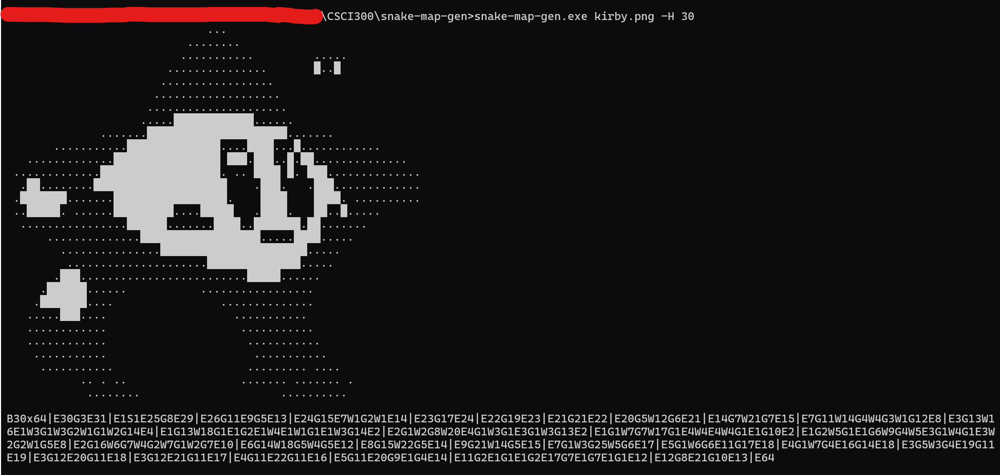

# snake-map-gen
### A quick fork of [ascii-image-generator](https://github.com/TheZoraiz/ascii-image-converter)

snake-map-gen is a command-line tool that converts images into ascii art, and subsequently run-length encoded maps for Snake!

Supported input formats:
* JPEG/JPG
* PNG
* BMP
* WEBP
* TIFF/TIF
* GIF

## Installation

Either download and run [the executable](https://github.com/MiloAkerman/snake-map-gen/releases/tag/release) in a folder of your choosing or download the code provided here and compile it with Go.

## Usage

In the same folder as the executable, open your command prompt and enter `snake-map-gen <PATH_TO_IMAGE>`. That easy!

If the image is too big, you can put `-H <NUMBER>` after the file name to adjust the height. The map generator will try to automatically place your snake in the best place, but this might not always be where you want! Feel free to move the snake around afterwards.